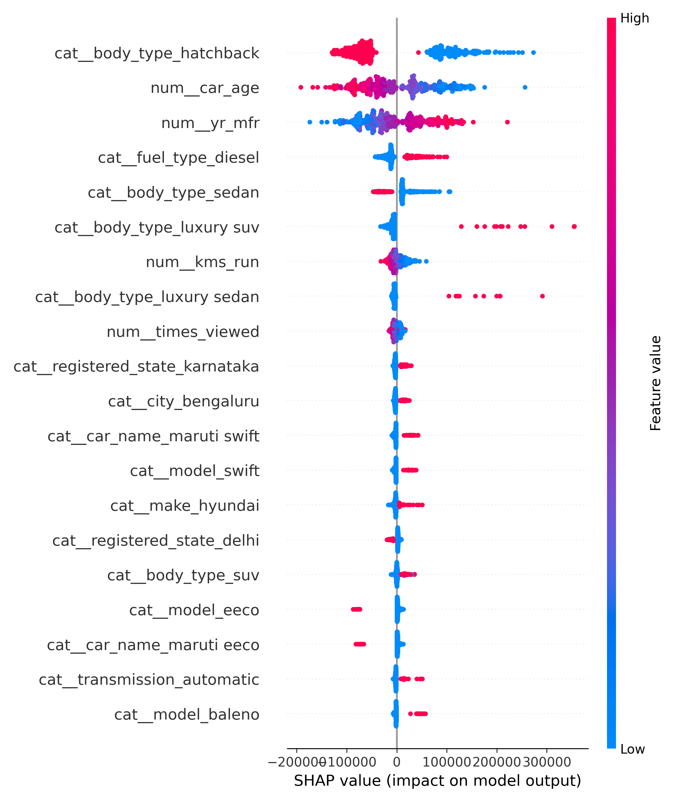
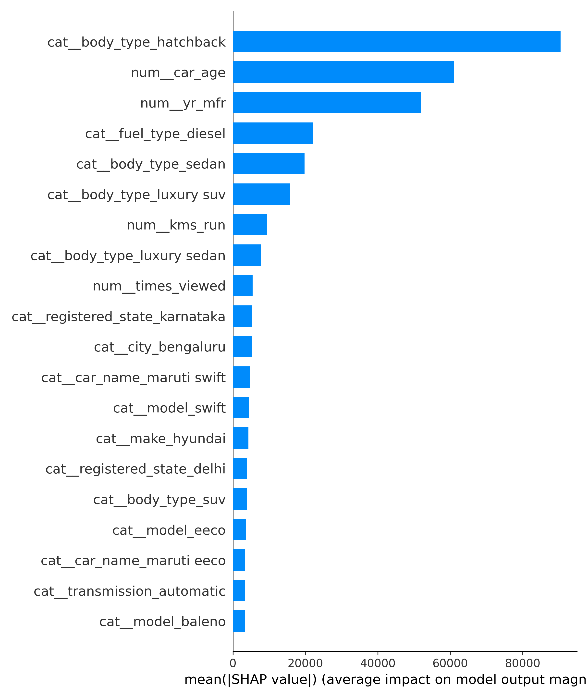
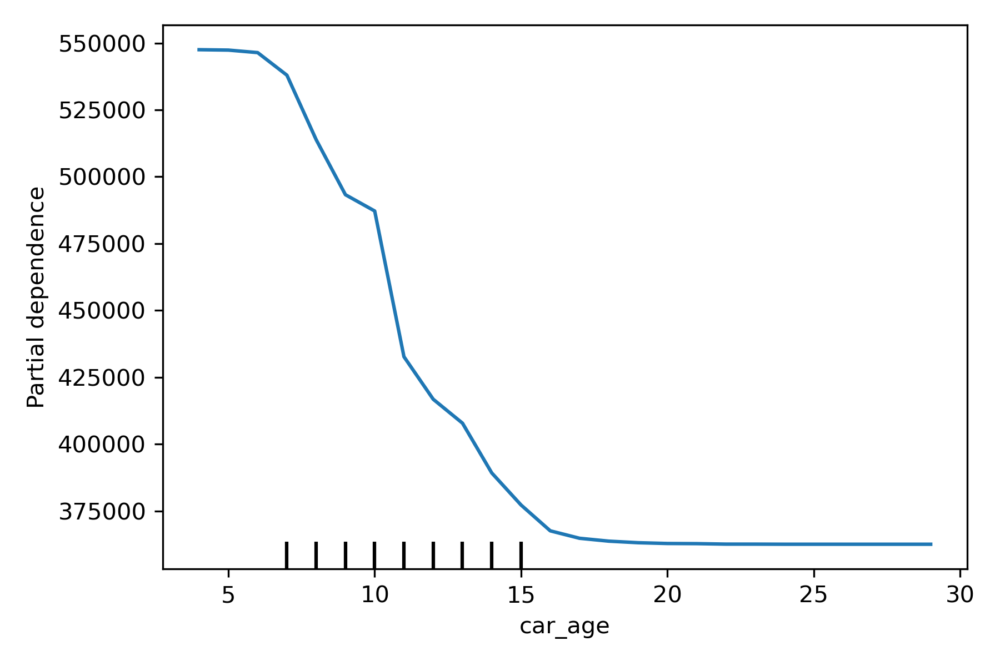

# 🚗 Used Car Price Prediction

An end-to-end ML project to predict the resale price of used cars.  
Includes **data cleaning, feature engineering, model training, explainability (SHAP/PDP), and a Streamlit web app**.

---

## 📊 Results

| Model                |    R² |    RMSE |    MAE |
|----------------------|------:|--------:|-------:|
| Linear Regression    | 0.878 | 102,672 | 51,135 |
| Random Forest        | 0.892 |  96,584 | 45,485 |
| HGBR                 | 0.866 | 107,684 | 52,343 |
| RF (log-target)      | 0.885 |  99,412 | 45,967 |
| Tuned RF             | 0.893 |  95,995 | 45,689 |
| XGBoost              | 0.918 (CV mean) | ~ | ~ |
| LightGBM             | 0.887 (CV mean) | ~ | ~ |
| CatBoost             | 0.911 (CV mean) | ~ | ~ |
| Stacking Ensemble    | 0.915 |  85,610 | 39,738 |

👉 **Best App Model:** `RF_app_best_model.pkl`  
- Balanced accuracy & stability  
- Input schema locked with `expected_columns.json`

---

## 🛠️ Tech Stack

- **Python**: pandas, numpy, scikit-learn, xgboost, lightgbm, catboost  
- **Explainability**: SHAP, PDP  
- **UI**: Streamlit  
- **Deployment**: Hugging Face Spaces / Local Streamlit

---

## 📂 Project Structure

.
├── app.py                # Streamlit UI
├── requirements.txt
├── results/
│   ├── models/           # Saved models
│   │   ├── RF_app_best_model.pkl
│   │   ├── expected_columns.json
│   │   └── …
│   └── plots/            # SHAP & PDP visualizations
│       ├── shap_summary_beeswarm.png
│       ├── shap_summary_bar.png
│       └── pdp_car_age.png
└── notebooks/            # Training & EDA

---

## 🚀 Run Locally

pip install -r requirements.txt
streamlit run app.py

---

## 🧑‍🏫 Explainability

**SHAP Beeswarm**  

**SHAP Bar Importance**  

**PDP: Car Age vs Price**  

---

## 📜 Model Card

### Intended Use
Estimate resale prices of cars for **educational & demo purposes**.  
Input limited to 11 core features (Year, KMs driven, Make, Model, Fuel, Transmission, Owners ≤ 3, City, State…).

### Performance
- Best Random Forest model (tuned) → R² ≈ 0.91  
- MAE ~ ₹40–50K → acceptable for ballpark pricing.

### Limitations
- Dataset mixes currencies/markets → predictions should be treated as **relative, not absolute**.  
- Doesn’t include external market conditions (fuel prices, seasonal demand).  
- Model can’t extrapolate well for very rare brands/variants.

### Ethics
- No sensitive personal data included.  
- Not intended for real financial decisions.

---

## 📌 Next Steps

- Deploy on **Hugging Face Spaces** (free hosting).  
- Try **CatBoost + cross-validation** for more robustness.  
- Add **partial dependence plots** for recruiter-friendly visualizations.  
- Extend Streamlit app with **file upload (bulk prediction)**.

---

## 📜 License

MIT License © 2025 Ayush
